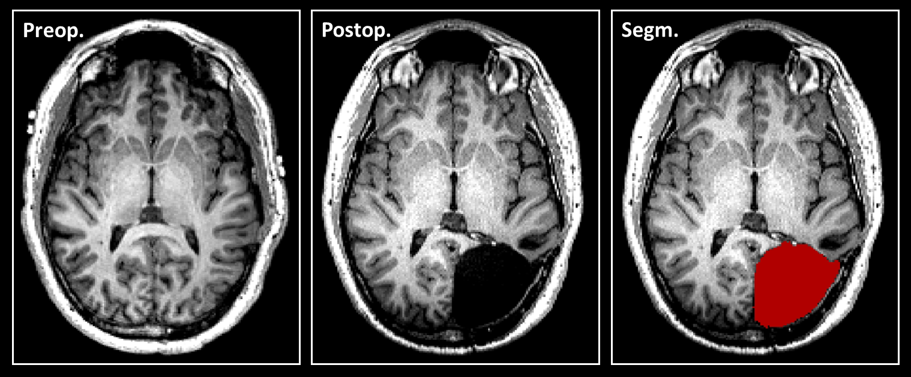

# ResectVol DL

Automatic segmentation and volumetric analysis of brain lacunae from T1 MRI scans.
<br>Tested in resective surgery lacunae in patients with epilepsy and brain tumor.

---

## Features


- Automatic segmentation of brain lacunas using nnU-Net v2
- Region labeling (requires SPM12, ANTs, and FSL)
- Atlas-based volumetric description of resections

---

## 1. Installation
1) ResectVol DL relies on the nnU-Net framework. Please install nnU-Net [VERSION 2](https://github.com/MIC-DKFZ/nnUNet) on your Linux system to run ResectVol DL. <br> Weights can be downloaded [here](https://drive.google.com/file/d/1uk7UDjOARlEwNSnxlO8nyQUM3ihTl5zM/view "ResectVol DL weights"). <br> To install weights use the bash command (available after nnU-Net installation): 
```bash
nnUNetv2_install_pretrained_model_from_zip
```

2) Clone repository:
```bash
git clone https://github.com/your-username/resectvol_dl.git
cd resectvol_dl
```


3) Install dependencies:
```bash
pip install nibabel numpy scipy pandas nipype
```


4) To run region labeling, please also install SPM12 (Matlab-based), FSL, and ANTs.

---

## 2. Usage
ResectVol DL first runs lacuna segmentation for all images, and then runs labeling.

Example calls:

	
  **1) Lacuna segmentation only** <br>
  ```bash
  ./resectvol_dl.sh   /media/study1/data/   /media/study1/output -s
  ```
&emsp;Input ex.:\
&emsp;&emsp;.../data/img1.nii.gz\
&emsp;Outputs:\
&emsp;&emsp;.../output/img1_lacuna.nii.gz (lacuna mask)

 
  **2) Lacuna segmentation + region labeling** <br>
  ```bash
  ./resectvol_dl.sh   /media/study1/data/   /media/study1/output -sl
  ```
  &emsp;Input ex.:\
	&emsp;&emsp;.../data/img1.nii.gz\
	&emsp;Outputs:\
	&emsp;&emsp;   .../output/img1/img1_lacuna.nii.gz (lacuna mask)\
  &emsp;&emsp;   .../output/img1/img1_lacuna_labeled.nii.gz (color coded labels)\
	&emsp;&emsp;   .../output/img1/anat_descrip_img1_lacuna.txt (region labeling and volumetric information)\
	&emsp;&emsp;   .../output/img1/ROIs/ (folder containing labeled ROIs in separate nifti files)

  **3) Lacuna segmentation + QUICK region labeling (lower quality registration)** <br>
  ```bash
  ./resectvol_dl.sh   /media/study1/data/   /media/study1/output -slf
  ```
  &emsp;Input ex.:\
  &emsp;&emsp;.../data/img1.nii.gz\
	&emsp;Outputs:\
	&emsp;&emsp;   .../output/img1/img1_lacuna.nii.gz (lacuna mask)\
  &emsp;&emsp;   .../output/img1/img1_lacuna_labeled.nii.gz (color coded labels)\
	&emsp;&emsp;   .../output/img1/anat_descrip_img1_lacuna.txt (region labeling and volumetric information)\
	&emsp;&emsp;   .../output/img1/ROIs/ (folder containing labeled ROIs in separate nifti files)


NB: Lacuna segmentation is quite robust and rarely presents issues. On the other hand, labeling steps are more sensitive to image quality, which may cause errors in processing. In these cases, only the lacuna mask is generated.


Two sample datasets can be downloaded [here](https://drive.google.com/file/d/19Xgy-_ByZGXNYyP3QuGHCcIrwbRUBHHA/view?usp=drive_link "image samples").


Enjoy!


---

## 3. Licensing Note:
ResectVol DL is released under the BSD 3-Clause License (see [license](https://github.com/rfcasseb/resectvol_dl?tab=BSD-3-Clause-1-ov-file "License")).
This license applies only to the ResectVol DL code. Users are responsible for complying with the licenses of FSL, ANTs, SPM12, and other required third-party software.

<!--
---
## Citation

If you use ResectVol DL in your research, please cite:

    [Casseb RF, de Campos BM, et al., 2025. ResectVol DL: Automated segmentation and volumetry of brain lacunas in epilepsy surgery patients. Journal TBD / medRxiv preprint]
-->

---
## Acknowledgments

Developed at the University of Campinas (UNICAMP), 2025.

This software uses open-source tools from the neuroimaging community: ANTs, SPM12, and FSL, and python libraries (NiBabel, NumPy, SciPy, Pandas, Nipype, etc.).
